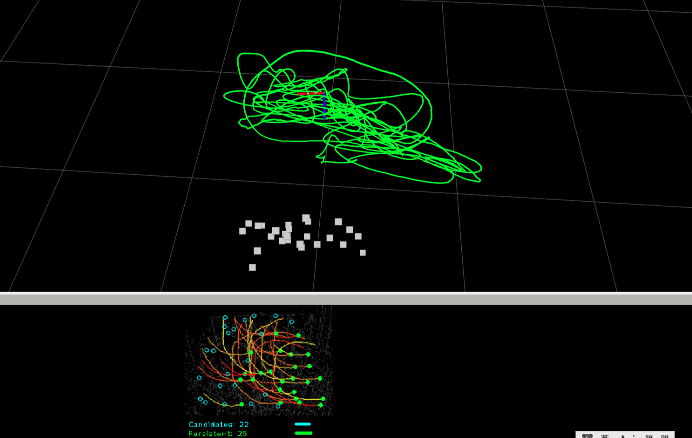
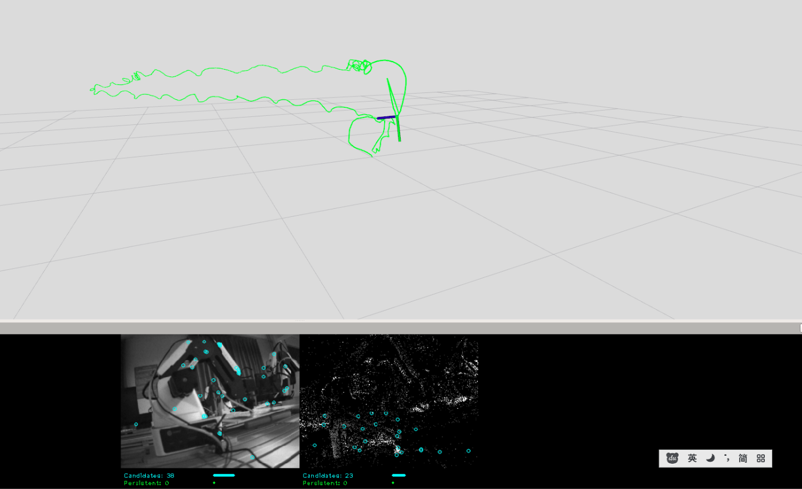
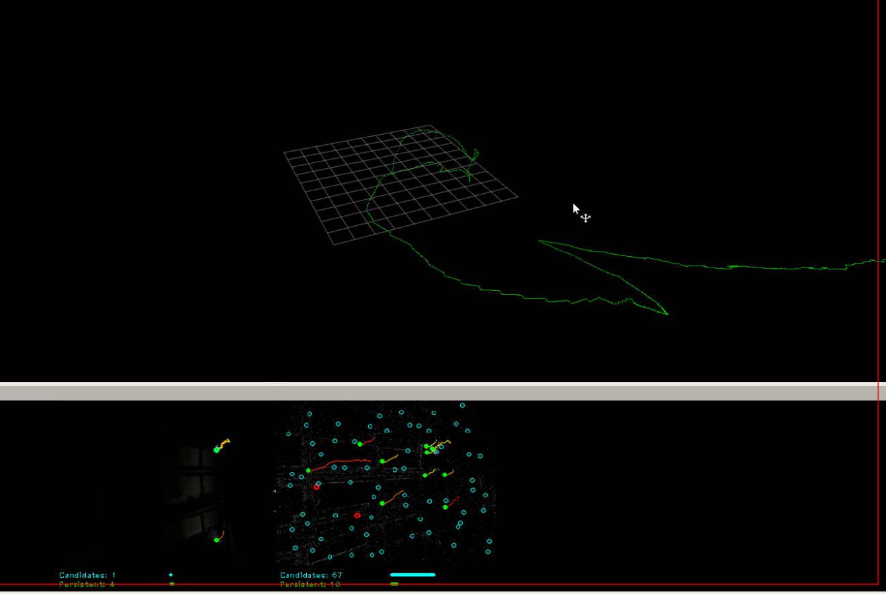
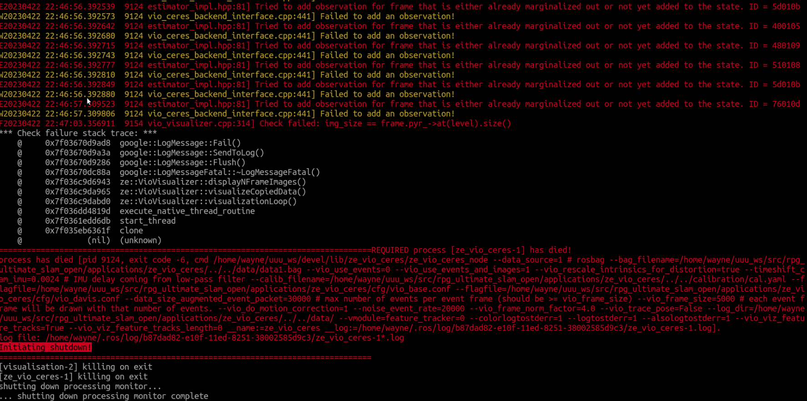
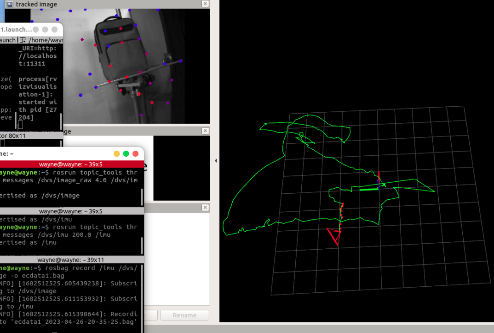
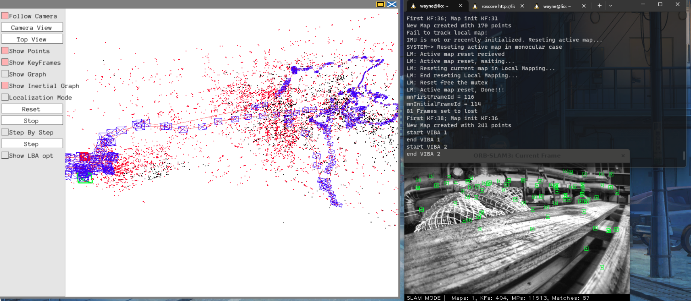
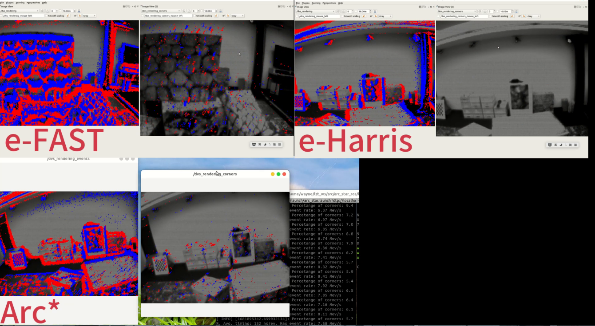

# Event-based Vision Resources for VO/VIO/SLAM

### By [wynelio](https://github.com/wynelio)

:ice_cream:This is a repository that records my research on VO/VIO/SLAM. :ice_cream:

#### I have tested the following algorithms up to now.

- [Tested SLAM algorithms](#Tested SLAM algorithms)
  - [1. Ultimate SLAM](#1- Ultimate SLAM)
  - [2. VINS_Mono](#2- VINS_Mono)
  - [3. ORB_SLAM3](#3- ORB_SLAM3)
- [Tested detection algorithms](#Tested detection algorithms)
  - [1. arc_star_ros](#1- arc_star_ros)

## Tested SLAM algorithms

### 1. [Ultimate SLAM](https://github.com/uzh-rpg/rpg_ultimate_slam_open)

- #### small scale

- #### middle scale

- #### large scale(failed)

#### issues(solved)

- img_size != frame.pyr_->at(level).size()

  

### 2. [VINS_Mono](https://github.com/HKUST-Aerial-Robotics/VINS-Mono)

### 3. [ORB_SLAM3](https://github.com/UZ-SLAMLab/ORB_SLAM3)

#### (Not yet tested with Davis346)

## Tested detection algorithms

### 1. [arc_star_ros](https://github.com/ialzugaray/arc_star_ros)

#### (Not yet tested with Davis346)

I also tested three kinds of **event-based corner detection** algorithms(e-FAST、e-Harris、Arc*).(Not yet tested with Davis346)(Not yet tested with Davis346)

